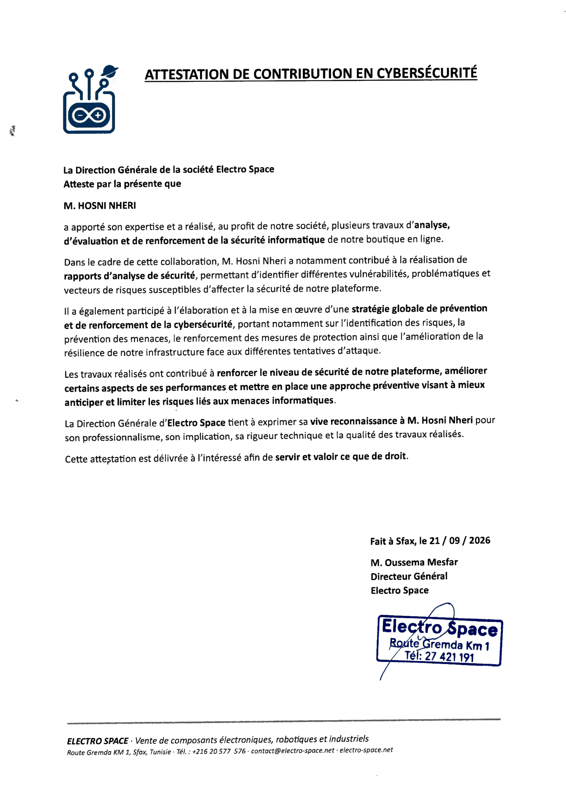

# Hosni Nheri — Security Portfolio

Cybersecurity engineering student focused on offensive security and penetration testing. This repo hosts a portfolio page built around a real, anonymized field engagement: a preliminary security and traffic-abuse audit of a WordPress/WooCommerce e-commerce platform.

**[View the portfolio →](./index.html)**

## What's in this repo

```
.
├── index.html          # Portfolio page (case study, methodology, skills)
├── assets/
│   └── certificate.png # Client attestation of contribution
└── README.md
```

## About the case study

The featured engagement was a 5-day, read-only audit covering:

- Distinguishing automated/bot traffic from genuine customer visits
- Reconnaissance-scan detection (probes for diagnostic files, credential-shaped paths)
- WooCommerce application-function abuse (cart, product-compare)
- A staged, risk-managed Cloudflare remediation rollout (deploy the unambiguous fixes first, observe, then add targeted behavioral/rate rules — with an explicit table of controls considered and rejected as too risky)
- Preliminary static review for SSRF / XSS / CSRF / SQL injection / RCE indicators

The client's name, domain, and any infrastructure details (IP addresses, exact endpoint paths, plugin versions, firewall rule expressions) have been intentionally left out of the public writeup. The full technical report was delivered privately to the client; what's published here is the methodology and outcome, which is what the work actually demonstrates.

## Client attestation

The client's Direction Générale issued the following signed attestation confirming the scope and quality of the work:



> *"[Hosni Nheri] contributed his expertise and carried out, on behalf of our company, several security analysis, assessment, and hardening projects for our online store... The work carried out helped strengthen our platform's security level, improve certain performance aspects, and put in place a preventive approach to better anticipate and limit IT-related risks."*
> — M. Oussema Mesfar, Director General, Electro Space

## Contact

- GitHub: add your profile link here
- Email / LinkedIn: add your contact details here
